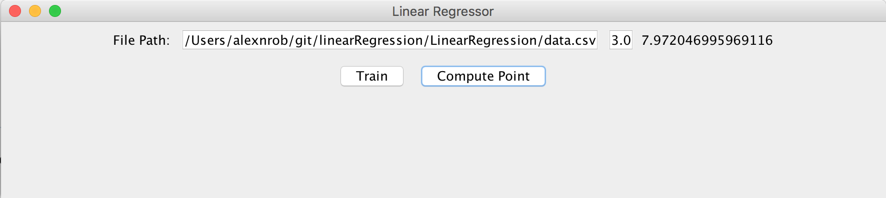
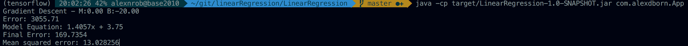

Linear Regression Calculator
============================

Simple GUI:

Model:

Example project:
- Runs a linear regression on example data provided via .csv
- Allows user to compute input points given the linear model

Build instructions:
- `mvn package`
- `java -cp target/LinearRegression-1.0-SNAPSHOT.jar com.alexdborn.App`
